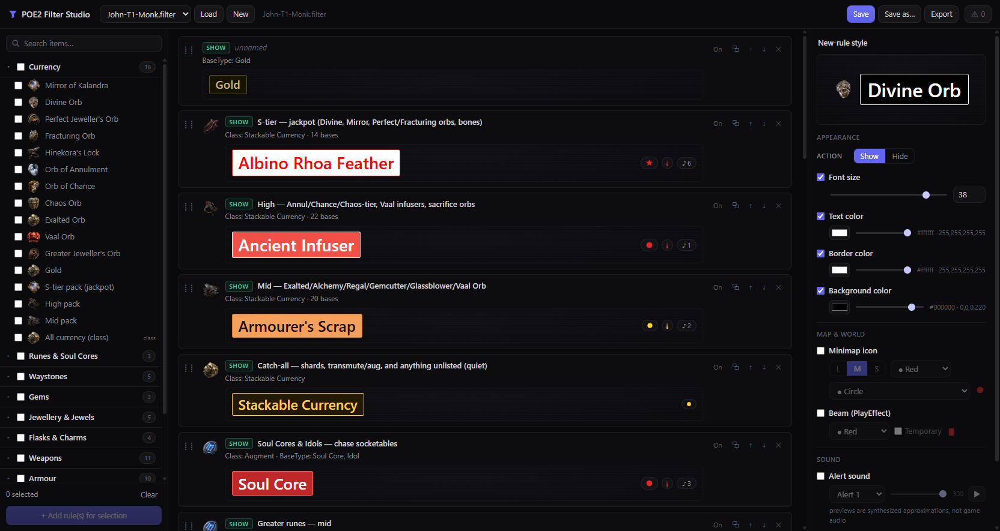

# POE2 Filter Studio

A free, local, visual loot-filter editor for **Path of Exile 2**. Select items individually or by group, restyle them all at once — colors, alert sounds, minimap icons, beams — with live label previews, and save straight into your game's filter folder (with automatic backups).



## Features

- **Bulk editing** — check any mix of individual items and whole groups in the catalog, add rules for the selection in one click, and every style change applies live to all selected rules at once. Ctrl/Shift-click also multi-selects existing rules for bulk restyling.
- **Live previews** — every rule renders its label the way it will look on the ground in game (text/border/background color, font size), plus pills for its minimap icon, beam, and alert sound. Click a sound pill to hear a preview (synthesized approximations, not game audio).
- **Item catalog** — currency (with value-tier packs), runes & soul cores, waystones by tier band, gems, jewellery, flasks & charms, every weapon and armour class, defence-profile armour presets (pure Evasion/ES etc.), uniques, omens/logbooks/keys. Every class and base name is verified against real filter data — nothing invented.
- **Understands real filters** — open your existing `.filter` file and it round-trips losslessly: comments, unknown/new syntax, and disabled blocks are preserved exactly. Disable a rule in the UI and it's kept in the file as a `#!` comment block you can re-enable later.
- **First-match-wins aware** — drag rules to reorder, and a warnings drawer flags dead rules that are shadowed by an earlier catch-all, out-of-range values, and other foot-guns.
- **Safe saves** — every overwrite backs up the previous version to `backups/` with a timestamp. Export downloads the file if you'd rather not write directly.

## Quick start

Requires [Node.js](https://nodejs.org) 20+ (no other dependencies, no build step).

```
git clone https://github.com/John-Holik/poe2-filter-studio
cd poe2-filter-studio
npm start
```

Then open **http://127.0.0.1:7444** — or on Windows just double-click `start.cmd`, which does both.

Load an existing filter from the dropdown, or hit **New** and build one from the catalog. After saving, reload it in game: **Options → Game → Item Filter → Reload**.

## Filter folder

By default the app reads and writes filters in the game's folder:

```
<home>\Documents\My Games\Path of Exile 2
```

If your filters live elsewhere, point the server at them:

```
node server.js --dir="D:\wherever\filters"
# or
set POE2_FILTER_DIR=D:\wherever\filters && npm start
```

The server binds to `127.0.0.1` only — nothing is exposed to your network.

## Import to game (PC / PS5 / Xbox)

Pick your platform in the top bar and hit **Import to game**:

- **PC** — the filter is saved into the game's filter folder, and the app shows the reload steps (Options → Game → Item Filter → Reload). Saving is importing on PC.
- **PS5 / Xbox** — consoles can't read local files, so PoE2 uses *online item filters* tied to your pathofexile.com account. The button copies your filter text to the clipboard, opens [your item filters page](https://www.pathofexile.com/account/item-filters), and walks you through it: add a new filter, set the game to Path of Exile 2, paste, save, and click **Follow** — it then shows up in the in-game filter list on your console. One-time setup: link your PSN/Xbox login to your PoE account under **Manage Account → Secondary Logins**.

## How selection → rules works

Filter blocks run top-to-bottom and the first match wins. When you add rules for a selection, the app buckets it so the output is correct by construction:

- individual bases → one rule per class (`Class ==` + `BaseType ==` list)
- whole classes → a `Class ==` rule
- specials (waystone tiers, defence profiles, uniques) → their condition templates
- specific rules are always inserted **above** broader class rules so they can actually fire

New rules go to the top of the filter; drag them wherever you want after.

## Item images

Item icons are loaded at runtime from Grinding Gear Games' official CDN (`web.poecdn.com`) — the same source the official trade site uses. **No game art is distributed with this tool**; if you're offline the UI simply falls back to glyphs.

## Development

```
npm test          # engine unit tests (parser/serializer round-trip, validation)
```

`CONTRACT.md` documents the module boundaries: `engine.js` (parse/serialize/validate), `catalog.js` (item data), `app.js` (UI), `server.js` (static + filter file API).

## Credits

- This is unaffiliated fan work. Path of Exile 2 and all item art are © [Grinding Gear Games](https://www.grindinggear.com/).
- Item class and base-type names were verified against [NeverSink's PoE2 filter](https://github.com/NeverSinkDev/NeverSink-Filter-for-PoE2) — an excellent filter; if you want a maintained, ready-made one, use theirs.

## License

[MIT](LICENSE)
